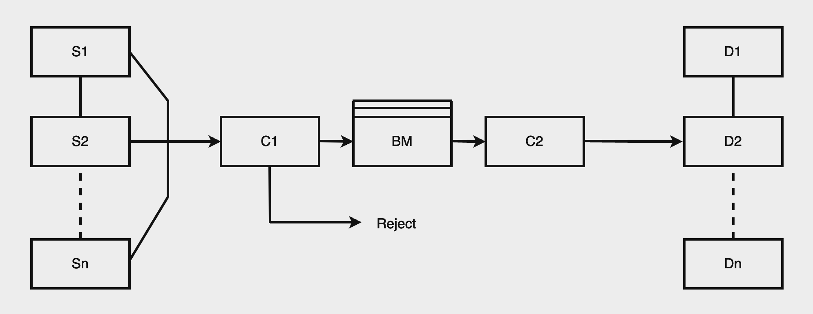
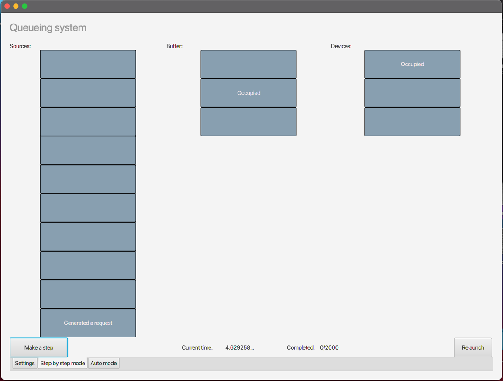
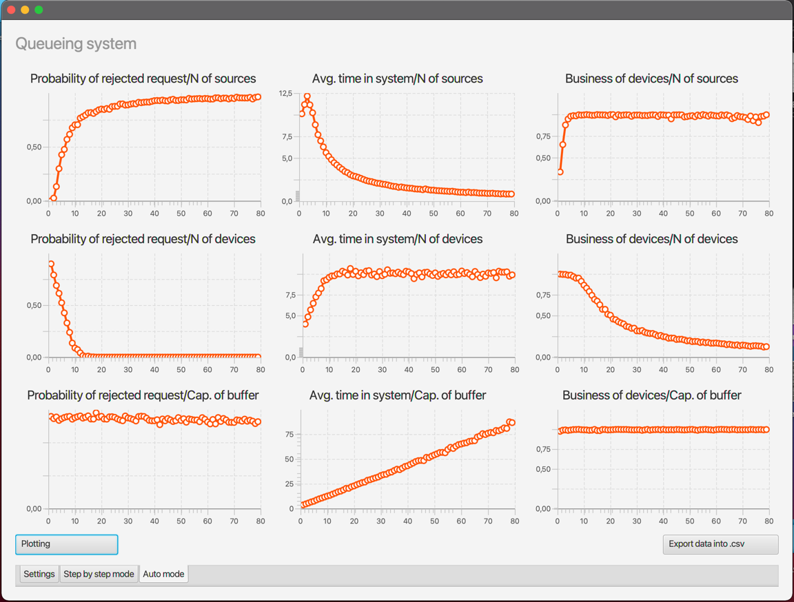
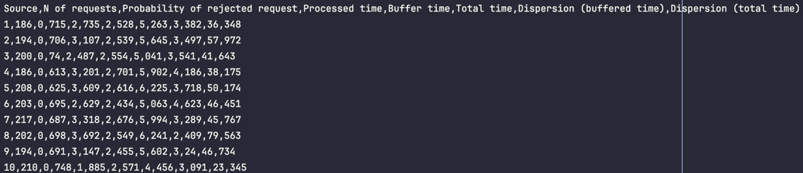
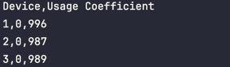
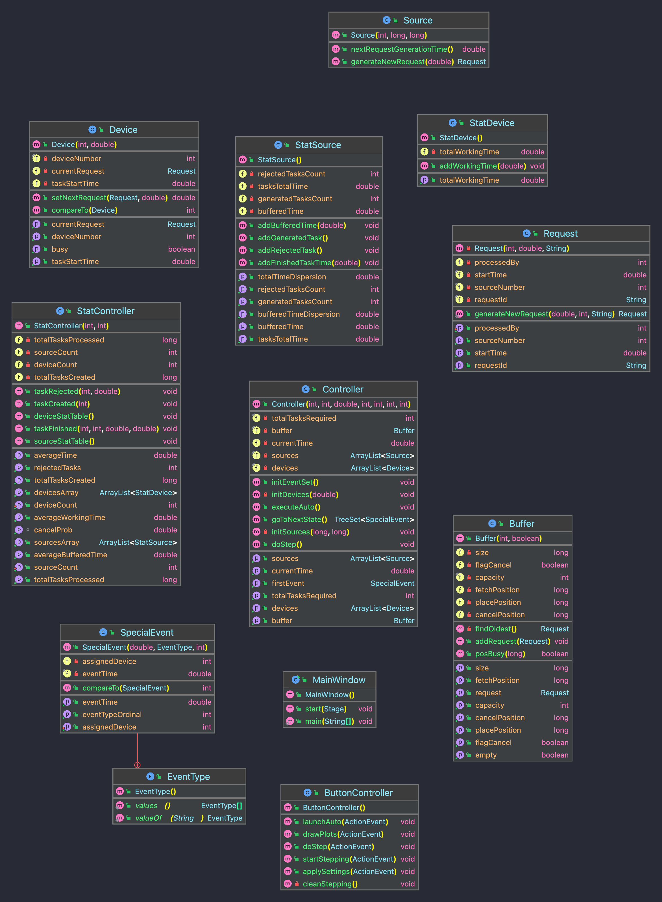
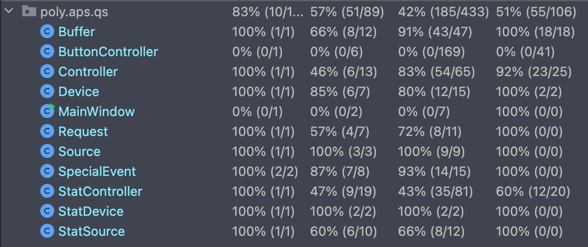

# Queueing System
___
## 1. Brief Description
This Java-application was created as a part of the laboratory course "Architecture of Programmed Systems" at the Peter the Great Saint Petersburg Polytechnic University. It is a prototype of a real queueing system meant to simulate and investigate the behaviour of it.
___
## 2. Theory
### Imitation modeling
Simulation modeling is a method that allows building models describing processes as they would occur in reality. Such a model can be "played" over time for both a single trial and a specified number of trials. The results are determined by the random nature of the processes. Sufficiently robust statistics can be obtained from this data.

Simulation modeling is a research method where the studied system is replaced by a model that accurately describes the real system, and experiments are conducted with it to obtain information about the system. Experimentation with the model is called simulation (simulation is understanding the essence of a phenomenon without resorting to experiments on the real object).

A simulation model is a logical-mathematical description of an object that can be used for computer-based experimentation for the purposes of designing, analyzing, and evaluating the object's functioning.

### Queueing system 
One approach to constructing a simulation model is to build it as a queuing system (QS), with terminology characteristic of QS:

* Source (S)
* Buffer (B)
* Device (D)
* Controller (C)
* Request (R)


*Figure 1. Example structure of a queuing system*

In Figure 1, Si (i = 1...n) represents a source of requests, which generates requests, and together n sources create the input flow of requests into the system. The sources can be of two types: finite and infinite. The difference lies in the method of request generation.

Di - Servers that process requests and create the output flow of requests after servicing.

BM - Buffer Memory (storage place for the queue of requests). Buffer memory can be of two types: general and zonal.

General memory stores requests from various sources. The order of their recording in the BM is determined only by the buffering discipline.

Zonal memory represents a buffer divided into zones, each of which records requests only from a specific source. Thus, the number of zones corresponds to the number of sources.

C1 - Controller (Dispatcher) for placing requests in the queue.

C2 - Controller (Dispatcher) for selecting requests from the queue. The functioning of the queuing system is modeled by the passage of a request generated by the source through the system. Let's trace the path of a request entering the model of the system:

1. Placement of the request in the buffer
2. Rejection or deletion of the request from the overfilled buffer
3. Selection of the request from BM for servicing
4. Search for an available device
5. Servicing the request by the device
6. Exit of the request from the queuing system

Sources only generate requests, devices only service them, and the logic of request passage through the system is determined by controllers.

Controller 1 performs two tasks:

1. Sends the request for servicing or to buffer memory if no free servers are available
2. Organizes rejection or deletion of the request from BM if there are no free spaces left in the buffer

Controller 2 performs two tasks:

1. Selects the device for servicing the request
2. Selects the request from BM if there is one

The operating principle of the queuing system considered is based on the simulation of a single multidimensional request processing process. The processes are modeled through the sequence of system states over time. The modeling algorithm allows simulating behavior, i.e., changes over time in the states of objects and events constituting the studied process.

### Technical specifications of the model were chosen as follows:
1) **Number of requests:** each source generates an infinite number of requests
2) **Source generation policy:** time before a next request is determined by uniform distribution law
3) **Device processing policy:** time for each device to process one request is determined by exponential law
4) **Buffer placement policy:** ring buffer selection - every new request added is placed on the next available place in a cycle (if the very last place is taken, it goes on the first)
5) **Buffer rejection policy:** the oldest request in the buffer is rejected upon overflow (FIFO)
7) **Buffer withdrawal policy:** the newest request in the buffer goes to a free device (LIFO)
6) **Device selection policy:** ring device selection
8) **Displayed data for step-mode simulation:** formalized model state diagram
9) **Displayed data for auto-mode simulation:** parameter value graphs

### Collected data:
For each source:
1) **N of generated requests**
2) **Probability of a request being rejected:** N of rejected requests / N of requests
3) **Average processing time of generated requests:** t total - t buffer
4) **Average buffer time of generated requests:** t buffer
5) **Average total time of generated requests:** t total
6) **Dispersion (buffered time)**
7) **Dispersion (total time)**
<p>For each device:
Business coefficeint was calculated:</p>
Total processing time of each device / t total

___
## 3. Stack of technologies
* Java JDK 16 (OpenJDK)
* JavaFX 16 (Controls and fxml)
* JUnit 5
___
## 4. Interface
The screenshots of the GUI are presented below:
<br />
### Inital settings:

*Figure 2.*
### Step-mode visualisation:

*Figure 3.*
### Auto-mode visualisation:

*Figure 4.*
### Output files with statistics collected (in .csv format):

<br />
*Figure 5. File: source_stats.csv*
<br/>

<br />
*Figure 6. File: device_stats.csv*
<br/>
___
## 5. UML Diagram (Auto-generated)

___
## 6. Testing
The test coverage is presented below: (todo: add more tests)
<br />

___
## 7. Launching the project
To build and run - type in the following command:
```
mvn clean javafx:run
```
___
